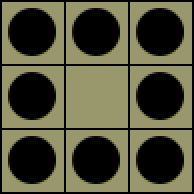
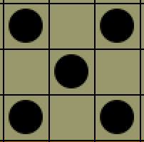
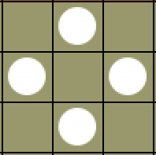
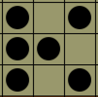
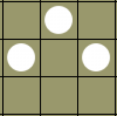

# Towerkrieg
#### A strategy game in the tradition of chess.


Although an enjoyable game in its current state, Towerkrieg is intended to serve as a testbed for ML algorithms I am developing.
The current installation is stable but the game engine itself continues to be tested. Additionally, this readme.md is under construction.


## Getting Started
### Requirements
  * [Python 3](https://www.python.org/downloads/)
  * Tkinter: Part of the Python standard library and included in most installations. Test with:
    ```python
    import tkinter as tk
    ```
### Installation
Download into a single project folder in your favorite Python IDE.


## Match Rules
The objective of Towerkrieg is to destroy your opponent’s only tower. 

A tower is a ring of stones oriented in a 3x3 square area: 



A player can create new towers as the player’s remaining game pieces allow.

A player’s “piece” is a 3x3 square area that contains only stones of the player’s color and no stones of the player’s opponent. Proposed pieces with mixed color stones or no stones (empty squares only) are invalid. 

The piece is selected by clicking into the center square. If the selection is valid, all valid moves are highlighted in yellow.

### Direction of Movement

The composition of a piece dictates the direction it is allowed to move. If we exclude the center square and regard the 8 peripheral squares, a piece can move in the direction of any square that is inhabited by a stone in that piece. 

To clarify, consider the piece’s peripheral squares with respect to the cardinal directions (i.e. north, south, east, west, and combinations thereof).

This piece can move northwest (NW), NE, SW or SE:



This piece can move N, S, W or E. Note that a center stone is not required to define a piece:



### Magnitude of Movement

The movement of a piece stops when an opponent’s stone blocks its path. This captures the opponent’s stone.

A piece with a center stone can move any unobstructed distance.

This piece can move any unobstructed distance NW, W, SW, NE or SE:



A piece without a center stone can move a maximum of 3 unobstructed squares (fewer squares are permitted).

This piece can move 1, 2 or 3 unobstructed squares N, W or E:



Squares in the border can be included in the selection of a piece but any stones that end up in the border squares of the game board are eliminated after every move.


## Contributing


## Acknowledge


## License
This project is covered by the [MIT license](https://mit-license.org).
